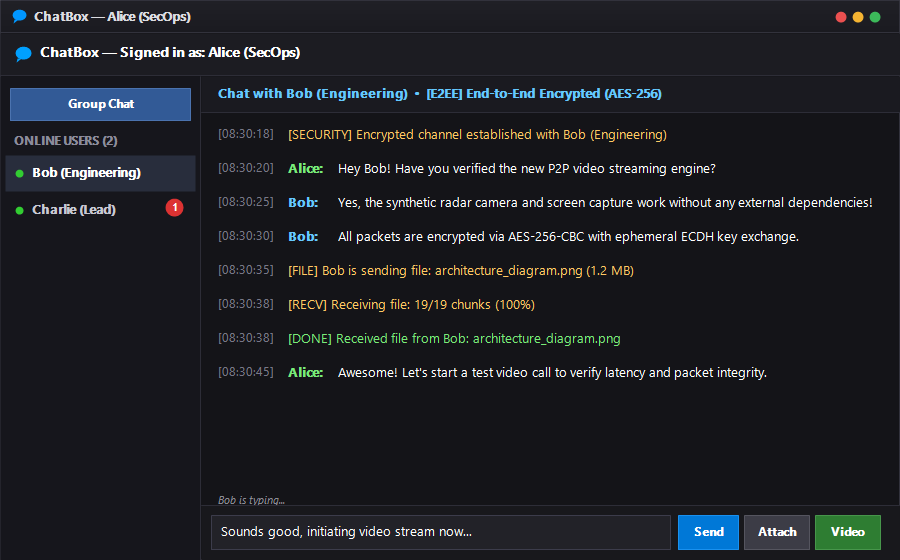
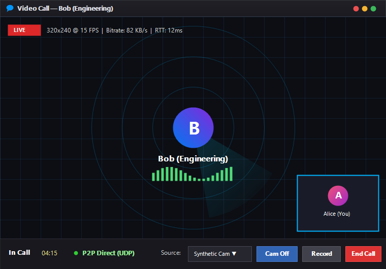
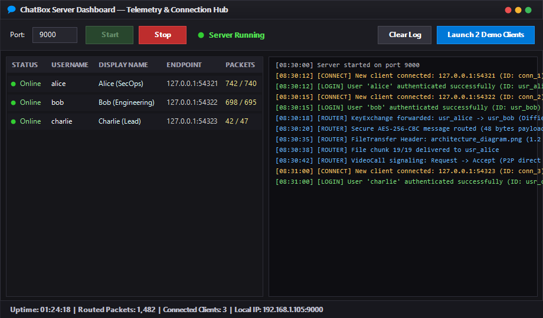
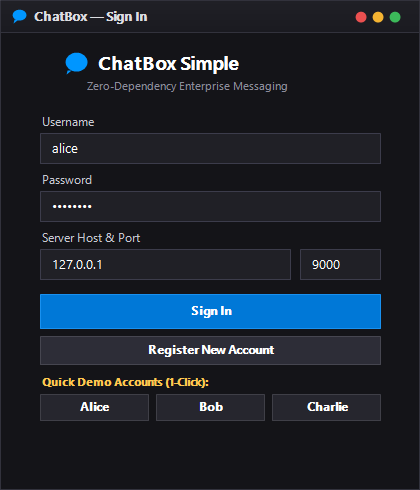

# 🌌 ZeroTalk — Sovereign Real-Time P2P & E2EE Communication Suite

[-007ACC?style=flat-square&logo=windows)](https://github.com/kzxl/ZeroTalk)
[](https://github.com/kzxl/ZeroUniverse)
[](https://dotnet.microsoft.com/)
[](https://github.com/kzxl/ZeroTalk)
[](https://dotnet.microsoft.com/)
[]()
[](LICENSE)


**ZeroTalk** is a sovereign, high-performance real-time communication platform engineered for local networks and distributed operations. Operating with **zero external NuGet package dependencies**, it runs on pure C# and native .NET Framework Base Class Libraries (BCL). Part of the **ZeroUniverse** application suite, it combines military-grade cryptography with low-latency multimedia streaming.

The platform showcases robust software engineering patterns: length-prefixed TCP binary framing, ECDH shared secret negotiation, AES-256-CBC end-to-end encryption, STUN NAT traversal with UDP hole punching, server relay fallback, pluggable synthetic camera video capture, desktop screen sharing, a live telemetry server dashboard, and an automated regression test suite.

---

## 📸 Interface Showcase

| Real-Time Chat & Direct Messaging | P2P Video Call & Synthetic Camera HUD |
| :---: | :---: |
|  |  |

| Server Management & Telemetry Console | 1-Click Demo Authentication |
| :---: | :---: |
|  |  |

---

## 🌟 Key Capabilities

### 1. Pluggable Video Streaming Pipeline (P2P & Relay)
- **Zero Webcam Hardware Required**: Features an embedded high-performance **Synthetic Camera** (`SyntheticVideoSource`) that generates animated radar sweeps, live millisecond clocks, dynamic audio frequency bars, and user identity badges at 15–20 FPS.
- **Desktop Screen Sharing**: Includes `ScreenCaptureVideoSource` to capture and stream the active desktop display in real-time.
- **Picture-in-Picture (PIP) & Camera Switch**: Local preview window rendered simultaneously over remote incoming streams with memory-safe GDI bitmap recycling.
- **STUN NAT Traversal (RFC 5389)**: Discovers public IP endpoints and initiates UDP hole punching for direct peer-to-peer streaming.
- **Automatic Server Relay Fallback**: Seamlessly falls back to TCP server relay when UDP hole punching is blocked by symmetric NATs or restrictive firewalls.

### 2. End-to-End Cryptography & Security
- **ECDH Key Exchange**: Implements Diffie-Hellman Elliptic Curve Key Exchange (`DiffieHellmanHelper`) for per-session shared secret negotiation.
- **AES-256-CBC Encryption**: End-to-end encrypted messaging with dynamically generated initialization vectors (IVs).
- **Secure Authentication**: SHA-256 hashed password storage (`UserStore`) with pre-seeded demo credentials.

### 3. Server Management & Real-Time Telemetry Dashboard
- **Live Client Directory**: `ListView` displaying client IDs, usernames, display names, IP endpoints, connection timestamps, and packet counters.
- **Administrative Controls**: Right-click context menu to disconnect/kick connected clients.
- **Real-Time HUD**: Live uptime clock, total routed message counters, and host IP address display for LAN discovery.
- **One-Click Multi-Client Launch**: Dedicated button to automatically spin up 2 demo client instances (`alice` and `bob`).

### 4. Client UX & Quick Demo Workflow
- **1-Click Demo Login**: Quick-access buttons for pre-seeded users (`👤 Alice`, `👤 Bob`, `👤 Charlie`).
- **CLI Automation**: Supports command-line auto-login arguments (e.g., `ChatBox.Client.exe demo_alice`).
- **File Transfer Progress**: Real-time chunk transmission progress (`cur/total chunks` and percentage indicator).
- **Dedicated Image Previewer**: Modal dialog (`frmImagePreview`) for viewing received `.jpg`, `.png`, `.gif`, and `.bmp` files with image dimensions, file size, and explorer shortcuts.
- **Tabbed Chat Interface**: Dynamic tabs for the public general room and private 1-on-1 conversations with unread indicators.

### 5. Automated Regression Test Suite (`ChatBox.Tests`)
- Custom lightweight test runner with zero third-party dependencies verifying:
  1. Packet serialization, length-prefixed framing, and UTF-8 encoding.
  2. AES-256 encryption/decryption roundtrips and ECDH shared key equivalence.
  3. User authentication, password hashing, and message history persistence.
  4. Video generator frame capture, synthetic radar animation, and JPEG SOI header validity.
  5. STUN packet construction and attribute parsing.
  6. Large file chunking, reassembly, and SHA-256 payload integrity.
  7. Cryptographic invariants (random IV uniqueness and tamper resistance).
  8. Floating PIP geometry and boundary clipping.

---

## 🏛️ System Architecture

```
ChatBoxSimple.sln
│
├── ChatBox.Shared/               # Core BCL Library (Shared across Server & Client)
│   ├── Constants/AppConstants.cs # Protocol ports, buffer limits, chunk sizes
│   ├── Crypto/                   # AES-256-CBC & Diffie-Hellman (ECDH) helpers
│   ├── DTOs/                     # Network data transfer contracts
│   ├── Network/StunClient.cs     # RFC 5389 STUN NAT traversal engine
│   └── Protocol/                 # Packet framing, packet types, and JSON serialization
│
├── ChatBox.Server/               # WinForms Server Management Host
│   ├── Data/                     # UserStore (JSON) & MessageStore (JSON history)
│   ├── Models/                   # ConnectedClient & UserAccount
│   ├── Services/                 # TcpServerService, AuthService, MessageRouter
│   └── Forms/frmServer.cs        # Telemetry HUD, Client list, and 1-click launcher
│
├── ChatBox.Client/               # WinForms End-User Client
│   ├── Forms/                    # frmLogin, frmChat, frmVideoCall, frmImagePreview
│   ├── Helpers/VideoRecorder.cs  # Video call recording hooks
│   └── Services/                 # Pluggable IVideoSource, VideoCallService,
│                                 # FileTransferService, FileReceiveService, UdpPeerService
│
└── ChatBox.Tests/                # Standalone Automated Test Runner (.NET 4.8)
    ├── Program.cs                # Test harness entry point (exit code 0/1)
    ├── ProtocolTests.cs          # Serialization and packet integrity tests
    ├── CryptoTests.cs            # Cryptographic roundtrip & invariant tests
    ├── StorageTests.cs           # Database and persistence tests
    ├── VideoSourceTests.cs       # Video frame generation, compression & PIP tests
    ├── StunTests.cs              # RFC 5389 STUN protocol tests
    ├── FileTransferTests.cs      # Chunking and reassembly tests
    └── DemoScreenshotGenerator.cs# High-resolution screenshot generator for documentation
```

---

## 📹 Video Call Flow Diagram

```
┌──────────────────────────────────────────────────────────┐
│  Client A                  Server               Client B │
│      │                        │                    │     │
│      ├──STUN Discovery───────→│                    │     │
│      │  (Public IP/Port)      │                    │     │
│      │                        │                    │     │
│      ├──VideoCallRequest─────→│───Forward Signal──→│     │
│      │                        │     ←──Accept──────┤     │
│      │   ←──Forward Signal────┤                    │     │
│      │                                             │     │
│      ├════════════ UDP Hole Punching ══════════════┤     │
│      │                                             │     │
│      │  [Success] → Direct P2P UDP Streaming       │     │
│      │  [Failure] → Fallback TCP Server Relay      │     │
│      │                                             │     │
│      └──Display Local PIP (Synthetic/Screen Share)─┘     │
└──────────────────────────────────────────────────────────┘
```

---

## 👥 Default Demo Accounts

All demo accounts are pre-seeded in `UserStore` with password `123`:

| Username | Password | Display Name | Role |
| :--- | :--- | :--- | :--- |
| `alice` | `123` | Alice Johnson | Demo User A |
| `bob` | `123` | Bob Williams | Demo User B |
| `charlie` | `123` | Charlie Davis | Demo User C |

---

## 🚀 Quick Start Guide

### Prerequisites
- **Operating System**: Windows 10 / 11 / Windows Server 2016+
- **Runtime**: .NET Framework 4.8 runtime (pre-installed on modern Windows)
- **Build Tools**: .NET SDK (`dotnet build`) or Visual Studio 2022 / MSBuild

### Automated 1-Command Demo Launcher
Run the PowerShell orchestrator script from the repository root:
```powershell
powershell -ExecutionPolicy Bypass -File .\scripts\run-demo.ps1
```
This script automatically:
1. Compiles the solution in `Debug` configuration.
2. Executes the regression test suite (`ChatBox.Tests.exe`).
3. Starts the Server Dashboard and binds to port `9000`.
4. Spawns two pre-configured demo clients (`Alice` and `Bob`) with automatic login.

---

### Manual Execution Steps

#### 1. Compile the Solution
```bash
dotnet build ChatBoxSimple.sln -c Debug
```

#### 2. Run the Test Suite
```bash
.\ChatBox.Tests\bin\Debug\ChatBox.Tests.exe
```

#### 3. Start the Server
```bash
.\ChatBox.Server\bin\Debug\ChatBox.Server.exe
```
- Click **▶ Start** to bind port `9000`.
- Click **⚡ Launch 2 Demo Clients** to launch both Alice and Bob simultaneously.

#### 4. Start the Clients
```bash
.\ChatBox.Client\bin\Debug\ChatBox.Client.exe demo_alice
.\ChatBox.Client\bin\Debug\ChatBox.Client.exe demo_bob
```
Alternatively, launch `ChatBox.Client.exe` and click **👤 Alice** or **👤 Bob** on the login screen for instant 1-click access.

---

## 📦 Build & Release Packaging (`scripts/publish-app.ps1`)

In adherence with enterprise deployment standards, the project supports both distribution modes:

```powershell
# Full release package (includes binaries, assets, and debug symbols):
powershell -ExecutionPolicy Bypass -File .\scripts\publish-app.ps1 -Mode Full

# Lite release package (optimized standalone binaries, excludes .pdb symbols):
powershell -ExecutionPolicy Bypass -File .\scripts\publish-app.ps1 -Mode Lite
```

Generated outputs are placed in `publish/Full` and `publish/Lite`, along with redistributable zip archives `ZeroTalk-v1.1.0-Full.zip` and `ZeroTalk-v1.1.0-Lite.zip`.

---

## 📄 License
This project is licensed under the MIT License - see the [LICENSE](LICENSE) file for details. Part of the **ZeroUniverse** ecosystem.
